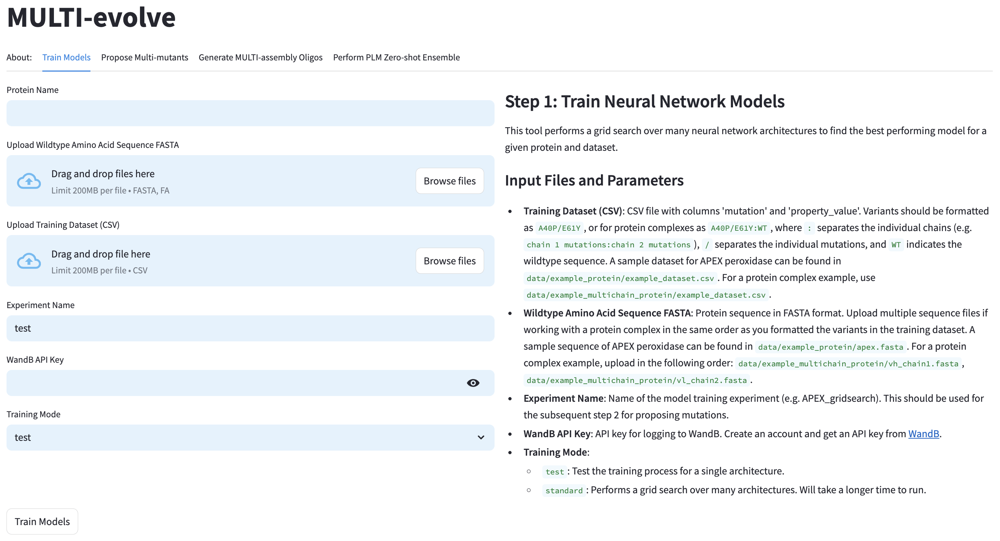

# Overview

Official repository for MULTI-evolve (model-guided, universal, targeted installation of multi-mutants), an end-to-end framework for efficiently engineering hyperactive multi-mutants. 

**The MULTI-evolve Python package has the following uses:**

1. Implement the workflow for the MULTI-evolve framework including: training neural networks, proposing multi-mutants, generating MULTI-assembly mutagenic oligos for gene synthesis of proposed multi-mutants, implementing the language model zero-shot ensemble approach to nominate single mutants to experimentally test.

3. Streamlined comparison of various data splitting methods, sequence featurizations, and machine learning models.

## Installation

### Linux

We used PyTorch 2.6.0 with CUDA 12.4 for our experiments. To run the scripts in this repository, we recommend using a conda environment.  Clone the repository, navigate to the root directory, and run the following commands to install the environment and package:
```bash
cd multievolve
conda env create -f env.yml
conda activate multievolve
pip install -e .
```
Check what torch+cuda version was installed by running:
```bash
python -c "import torch; print(torch.__version__)"
```

Then, run the following command, replacing `<VERSION>` with your torch version (e.g., `2.6.0+cu124`):
```bash
pip install torch-cluster==1.6.3 torch-geometric==2.6.1 torch-scatter==2.1.2 torch-sparse==0.6.18 torch-spline-conv==1.2.2 -f https://data.pyg.org/whl/torch-<VERSION>.html
```

For example, if your torch version is 2.6.0+cu124, you would run:
```bash
pip install torch-cluster==1.6.3 torch-geometric==2.6.1 torch-scatter==2.1.2 torch-sparse==0.6.18 torch-spline-conv==1.2.2 -f https://data.pyg.org/whl/torch-2.6.0+cu124.html
```

### Mac ARM-based

We used PyTorch 2.1.0 for our experiments. To run the scripts in this repository, we recommend using a conda environment.  Clone the repository, navigate to the root directory, and run the following commands to install the environment and package:
```bash
cd multievolve
conda env create -f env_mac.yml
conda activate multievolve
pip install -e .
```
Then, run:
```bash
pip install torch-cluster torch-geometric torch-scatter torch-sparse torch-spline-conv -f https://data.pyg.org/whl/torch-2.1.0+cpu.html
```

## Usage

The workflow for the MULTI-evolve framework is as follows:
1. Train fully connected neural networks to predict the fitness of a given sequence.
2. Choose the best performing neural network and use it to predict combinatorial variants.
3. For the chosen multi-mutants, generate the MULTI-assembly mutagenic oligos for gene synthesis.

In certain iterations, the MULTI-evolve framework involves using a protein language model zero-shot ensemble approach to nominate single mutants to evaluate.

### Interactive Web App

MULTI-evolve can be run as a interactive web app using Streamlit.

In the root directory of the repository run:
```bash
conda activate multievolve
streamlit run app.py
```


### Command-line

See the [Scripts README](scripts/README.md) to learn how to use MULTI-evolve via the Command-line.

## Training and comparing various machine learning models

The MULTI-evolve package can be used to compare different data splitting methods, sequence featurizations, and machine learning models. In addition, the package can be used to perform zero-shot predictions with protein language models (ESM, ESM-IF). Examples are provided in the ```notebooks/examples``` folder. 

## Contributors

MULTI-evolve is developed by Vincent Q. Tran ([VincentQTran](https://github.com/VincentQTran/)), Matthew Nemeth ([mnemeth66](https://github.com/mnemeth66)), Brian Hie ([brianhie](https://github.com/brianhie)).

## Citation

If you use this code for your research, please cite our paper:

```
@ARTICLE
author={Tran, Vincent Q. and Nemeth, Matthew and Bartie, Liam J. and Chandrasekaran, Sita S. and Fanton, Alison and Moon, Hyungseok C. and Hie, Brian L. and Konermann, Silvana and Hsu, Patrick D.},
title={MULTI-evolve: a machine learning-guided end-to-end framework for engineering hyperactive multi-mutant proteins},
year={2025},
journal={},
DOI={}
```
